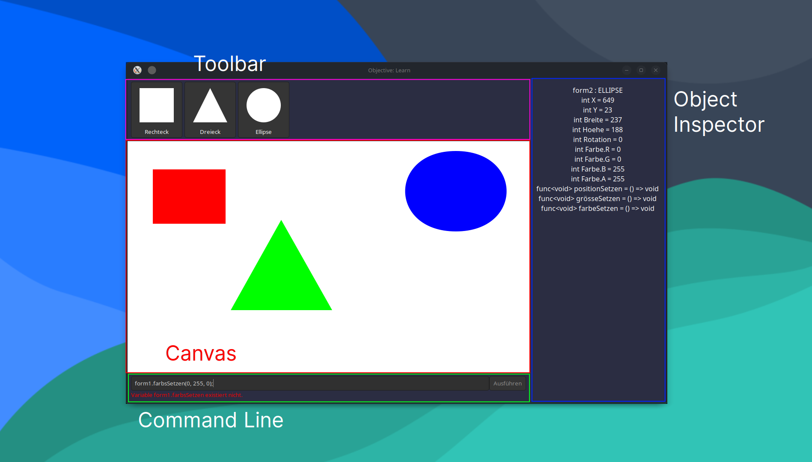

# Objective: Learn
Objective: Learn is a program made to teach children the basics of [OOP](https://en.wikipedia.org/wiki/Object-oriented_programming) with a Java-esque syntax.

# Using Objective: Learn
## UI Explanation


## Shapes
Shapes can be created in two ways:
 - Using the toolbar, select the shape you want to draw and drag over the canvas to create the shape
 - In the Command Line type the following:
 ```java
 var myShape = new RECHTECK(100, 100, 20, 50);
 ```
 Valid class names are `RECHTECK`, `DREIECK` and `ELLIPSE`. Every constructor accepts 4, 5, 8 or 9 arguments. These are the constructors:
| Number of arguments | Description                |
|---------------------|----------------------------|
|4                    | X, Y, Width, Height        |
|5                    | X, Y, Width, Height, Angle |
|8                    | X, Y, Width, Height, Angle, R, G, B |
|9                    | X, Y, Width, Height, Angle, R, G, B, Alpha |

Every Shape has these Attributes:
|Type|Name|Desc.|
|----|----|-----|
|int|X|The X position of the Shape|
|int|Y|The Y position of the Shape|
|int|Breite|The Width of the Shape's bounding box|
|int|Höhe|The Height of the Shape's bounding box|
|int|Rotation|The tilt angle of the Shape|
|int|Farbe.R|The Red Value of the Shape's color|
|int|Farbe.G|The Green Value of the Shape's color|
|int|Farbe.B|The Blue Value of the Shape's color|
|int|Farbe.A|The Shape's transparency|

...and these Methods:
|Method|Description|
|-|-|
|positionSetzen(int x, int y)|Sets the Shape's Position|
|grösseSetzen(int width, int height)|Sets the Shape's Size|
|farbeSetzen(int[0-255] r, int[0-255] g, int[0-255] b, int[0-255] a = 255)|Sets the Shape's Color. `a` is optional and defaults to 255.|
|winkelSetzen(int angle)|Sets the Shape's tilt angle|


# Building Objective: Learn
Objective: Learn supports Windows, Linux and MacOS, although MacOS is currently untested.
## Prerequesites
 - .NET 7

Only for compiling the Icons on Linux:
 - png2icns for Mac ICNS
 - ImageMagick for Windows ICO

## Build Commands
Windows:
```bash
dotnet build -p Platform=Windows
```
Linux:
```bash
dotnet build -p Platform=Linux
```
MacOS:
```bash
dotnet build -p Platform=MacOS
```
ICNS on Linux:
```bash
png2icns MacIcon.icns Icons/ObjectiveLearnLogo*.png

```
ICO on Linux:
```bash
convert Icons/ObjectiveLearnLogo512.png -define icon:auto-resize=255,64,48,32,16 -define png:conpression-strategy=0 WinIcon.ico
```
Note: All of the above commands need to be run in the `ObjectiveLearn/` directory, not the project root