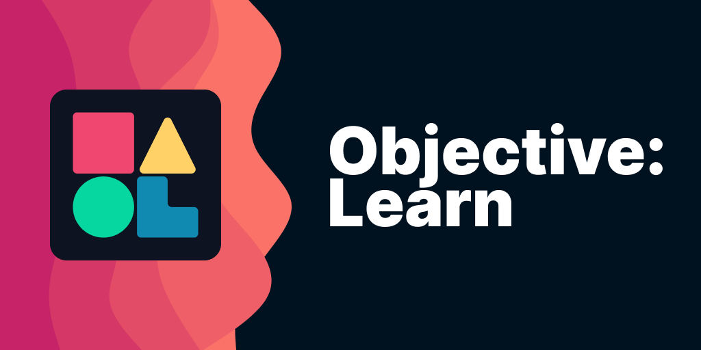
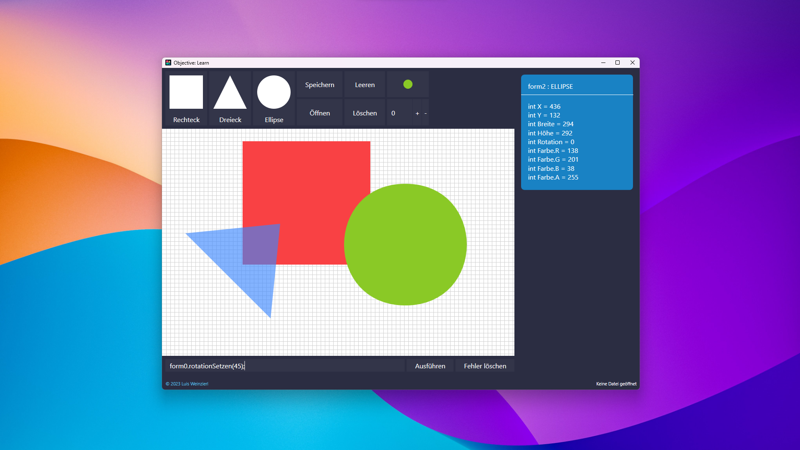

# Objective: Learn




Objective: Learn ist ein Programm, dass Kindern die Grundzüge von objektorientierter Programmierung spielerisch beibringt.

# Benutzung Objective: Learn

## Benutzeroberfläche



### Benutzeroberfläche im Lehrermodus


## Formen

Man hat zwei Möglichkeiten, Formen zu erstellen:

- Mithilfe der Werkzeugleiste kann das gewünschte Form-Werkzeug gewählt und in die Canvas eingezeichnet werden
- Über die Befehlszeile am unteren Rand des Fensters kann Java-ähnlicher Programmtext eingegeben und ausgeführt werden:

 ```java
 var meineForm = new RECHTECK(100, 100, 20, 50);
 ```

 Es gibt drei versch. Formklassen: `RECHTECK`, `DREIECK` und `ELLIPSE`. Jeder Konstruktor akzeptiert 4, 5, 8 oder 9 Parameter:
| Zahl der Parameter | Beschreibung                |
|---------------------|----------------------------|
|4                    | X, Y, Breite, Höhe        |
|5                    | X, Y, Breite, Höhe, Rotation |
|8                    | X, Y, Breite, Höhe, Rotation, R, G, B |
|9                    | X, Y, Breite, Höhe, Rotation, R, G, B, Transparenz |

Jedes Form-Objekt hat folgende Attribute:
|Typ|Name|Beschreibung|
|----|----|-----|
|int|X|Die X-Position der Form|
|int|Y|Die Y-Position der Form|
|int|Breite|Die Breite der Bounding-Box der Form|
|int|Hoehe|Die Höhe der Bounding-Box der Form|
|int|Rotation|Die Rotation der Form|
|int|Farbe.R|Der Rot-Wert der Farbe der Form|
|int|Farbe.G|Der Grün-Wert der Farbe der Form|
|int|Farbe.B|Der Blau-Wert der Farbe der Form|
|int|Farbe.A|Die Transparenz der Form|

...und folgende Methoden:
|Methode|Beschreibung|
|-|-|
|positionSetzen(int x, int y)|Setzt die Position der Form auf (`x`/`y`).|
|groesseSetzen(int width, int height)|Setzt die Größe der Bounding-Box der Form auf `width` breit und `height` hoch.|
|farbeSetzen(int[0-255] r, int[0-255] g, int[0-255] b, int[0-255] a = 255)|Setzt die Farbe der Form. `a` ist optional und ist standardmäßig `255`.|
|rotationSetzen(int angle)|Setzt die Rotation der Form auf `angle` (in Grad)|
|verschieben(int x, int y)|Verschiebt die Form um `x` auf der x-Achse und `y` auf der y-Achse.|

## Lehrermodus

Im Lehrermodus können die Schüler die Werkzeuge nicht mehr benutzen, sind also dazu gezwungen, die Befehlszeile zu verwenden. Der Lehrermodus kann aktiviert werden, indem `"TeacherMode"` in der .olcp-Datei auf `true` gesetzt wird. Auch kann man den Schülern Aufgaben per `"Task"` übergeben. Dafür einfach zwischen die Anführungszeichen (`[...]"Task":"(hier)"[...]`) die Aufgabe beschreiben.

## Languages
Objective: Learn unterstützt momentan Deutsch und US-Englisch. Man kann die Sprache anhand des `language` Attributs in der `appsettings.json` Datei verändern, wobei `de_DE` für Deutsch oder `en_US` für Englisch stehen. Die `appsettings.json` Datei befindet sich im gleichen Verzeichnis wie das eigentliche Programm.

### Texte bearbeiten 
Die Texte, die Objective: Learn verwendet, können verändert werden, indem man die `de_DE.json` bzw. `en_US.json` Datei bearbeitet. Eigene Sprachen können ebenfalls hinzugefügt werden, so bei hier das `language` Attribut in der `appsettings.json` auf den Sprachnamen gesetzt werden und eine Datei mit dem Sprachnamen + `.json` erstellt und mit den gleichen JSON-Objekten wie die anderen Sprachdateien befüllt werden muss. Bsp.: Die Sprache GB-Englisch soll hinzugefügt werden. Das Kürzel für diese Sprache lautet `en_GB`. Also muss die Datei `en_GB.json` erstellt werden und der Inhalt einer der anderen Sprachkonfigurationsdateien hinein kopiert werden. Sie können nun die Texte übersetzen. Anschließend müssen sie noch das `language` Attribut auf `en_GB` setzen, und ihre neue Sprache ist erstellt.